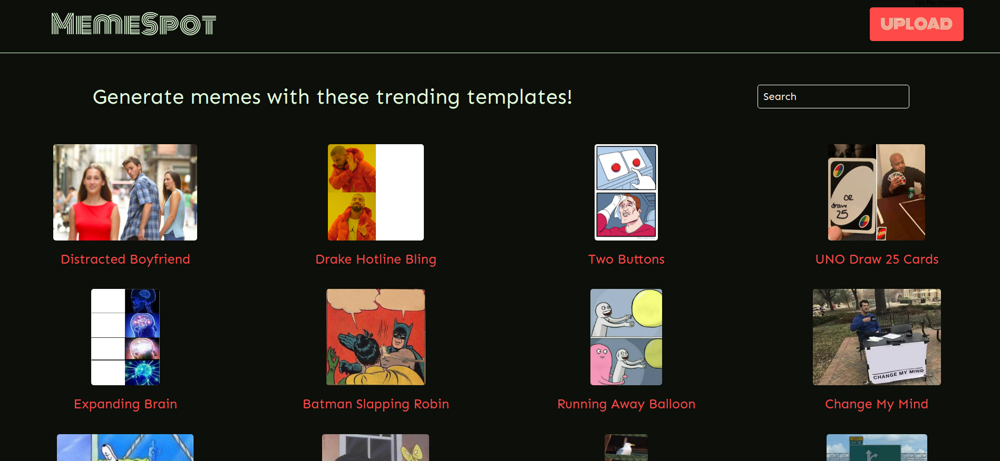
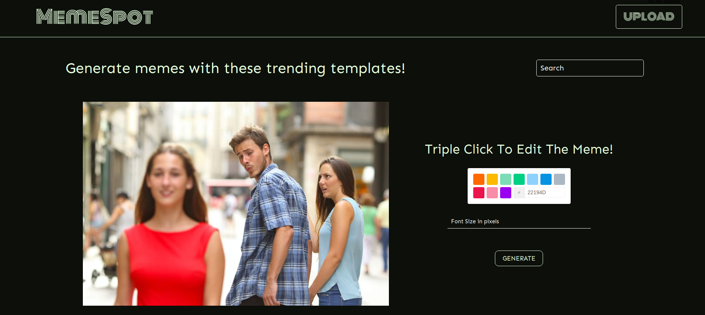
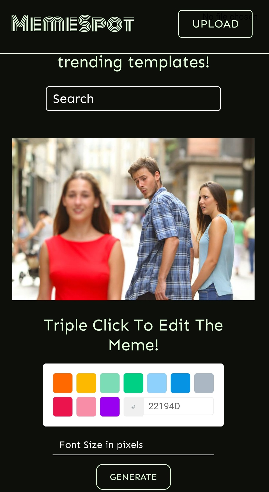

  

## An online Mememaker

You can choose any of the trending templates or even upload your own photo.
You can even choose the color and font size.
To edit the template just tap three times on the photo!
Then download the meme on the go!

## Build

## Web View:

## Mobile View

